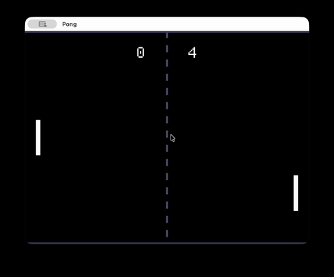

# Examples

## Square

The smallest game, a square that moves with the left and right arrow keys.

```sh
ludo play examples/square.ludo
```

## Pong



You play the left paddle against the computer. The first serve comes after a
second, and every goal starts a new one.

```sh
ludo play examples/pong.ludo
```

or, from the repository, without installing:

```sh
make play FILE=examples/pong.ludo
```

| Key | |
| --- | --- |
| W / Up | move up |
| S / Down | move down |
| F5 | restart |

Try changing a speed, like `let player_speed = 360.0`, and saving the file while
the game runs: it reloads without restarting.

What it shows of the language:

- the whole game is one value, `World`, and `update` returns a new one;
- the serve is a `sequence`: it waits, grows the ball with `over`, and then
  sets it moving;
- the net is `range(0, 16) |> map(dash)`, not a loop;
- `draw` returns shapes, and `config` sets the window.
